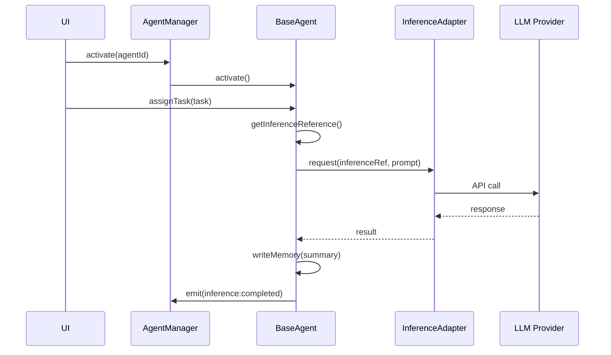

# Agent Framework Architecture — Douglas AI Platform

> Status: Foundation v0.1  
> Sprint: 3.1  
> Escopo: framework oficial de agentes em `packages/agents/`.

## Objetivo

Criar a infraestrutura oficial para centenas de agentes na Douglas AI Platform.

Nesta sprint não há IA, LLMs, OpenAI, Anthropic, Gemini ou chamadas externas. A entrega é o framework: tipos, registry, factory, manager, provider e contratos de extensão.

## Pacote

```
packages/agents/
├── package.json
├── tsconfig.json
└── src/
    ├── AgentTypes.ts       # Contratos centrais
    ├── AgentMemory.ts      # Memória por agente
    ├── AgentTask.ts        # Tarefas por agente
    ├── AgentEvents.ts      # Eventos e event bus
    ├── BaseAgent.ts        # Classe base + GenericAgent
    ├── AgentRegistry.ts    # Registro escalável
    ├── AgentFactory.ts     # Fábrica de instâncias
    ├── AgentManager.ts     # Orquestração de ciclo de vida
    ├── AgentContext.ts     # Contexto React
    ├── AgentProvider.tsx   # Provider global
    ├── useAgentFramework.ts
    └── index.ts
```

## Contrato de Agente

Todo agente possui:

| Campo | Tipo | Descrição |
|-------|------|-----------|
| `id` | `string` | Identificador único |
| `name` | `string` | Nome exibido |
| `department` | `string` | Departamento (escalável, sem enum fixo) |
| `description` | `string` | Propósito do agente |
| `status` | `AgentStatus` | idle, active, busy, disabled, offline |
| `priority` | `AgentPriority` | low, normal, high, critical |
| `permissions` | `AgentPermission[]` | Capacidades autorizadas |
| `capabilities` | `AgentCapability[]` | Habilidades funcionais |
| `memory` | `AgentMemoryState` | Entradas de memória |
| `tasks` | `AgentTaskRecord[]` | Tarefas associadas |
| `events` | `AgentEventRecord[]` | Histórico de eventos |
| `metadata` | `AgentMetadata` | Dados extensíveis |

Definição estática (`AgentDefinition`) separada de instância runtime (`AgentInstance`).

## Camadas

### AgentTypes

Contratos puros. Preparados para serialização (Supabase, API, Edge Functions).

Tipos extensíveis via union com `(string & {})` para `AgentCapability` e `AgentPermission` — suporta centenas de agentes sem alterar o core.

### AgentMemory

Memória local por agente:

- `fact`, `preference`, `context`, `summary`
- Escopos: `session`, `agent`, `workspace`, `global`
- Funções puras: `writeAgentMemory`, `readAgentMemory`

Futuro: substituir por store Supabase/pgvector sem alterar `BaseAgent`.

### AgentTask

Tarefas com status workflow: `queued` → `running` → `completed` | `failed` | `cancelled`.

### AgentEvents

`AgentEventBus` pub/sub para:

- `agent:activated`, `agent:deactivated`
- `memory:written`, `task:assigned`, `task:completed`
- `inference:requested`, `inference:completed` (preparado para LLMs)

### BaseAgent

Classe abstrata que implementa:

- getters para todos os campos do contrato;
- `writeMemory`, `readMemory`, `assignTask`, `completeTask`;
- `activate` / `deactivate` com hooks;
- `getInferenceReference()` — ponto de conexão futura com LLMs;
- `getSnapshot()` → `AgentInstance`.

`GenericAgent` é a implementação padrão para agentes sem classe customizada.

### AgentRegistry

Registro indexado por `Map<string, AgentDefinition>`:

```ts
registry.register(definition);
registry.registerMany(definitions);
registry.filter({ department: "Pesquisa" });
registry.getByDepartment("Desenvolvimento");
```

Projetado para centenas de entradas com lookup O(1).

### AgentFactory

Cria instâncias a partir de definições:

```ts
factory.registerType("research", ResearchAgent);
const agent = factory.create(definition, { typeId: "research" });
```

Tipo padrão: `generic` → `GenericAgent`.

Tipo customizado via `metadata.agentType`.

### AgentManager

Orquestra registry + factory + event bus:

- `bootstrap(definitions)` — registra e instancia em lote;
- `activate(agentId)` / `deactivate(agentId)`;
- `listInstances(filter)` — snapshots filtrados;
- `registerDefinition(definition)` — registro dinâmico.

### AgentProvider + useAgentFramework

Integração React. Definições vêm da aplicação via props — **nada hardcoded no pacote**.

```tsx
<AgentProvider definitions={agentDefinitions}>
  {children}
</AgentProvider>
```

Hook: `useAgentFramework()` (evita conflito com `useAgent()` do Brain).

## Integração no Headquarters

Definições em `apps/headquarters/features/agents/definitions.ts`.

`AppShell` envolve a aplicação:

```tsx
<SearchProvider>
  <AgentProvider definitions={agentDefinitions}>
    <BrainProvider>
      <CommandPaletteProvider>...</CommandPaletteProvider>
    </BrainProvider>
  </AgentProvider>
</SearchProvider>
```

## Como criar novos agentes

### 1. Definir o contrato

Adicionar entrada em `features/agents/definitions.ts`:

```ts
{
  id: "agent:novo",
  name: "Novo Agente",
  department: "Pesquisa",
  description: "Descrição do propósito.",
  status: "idle",
  priority: "normal",
  permissions: ["read:workspace", "read:memory", "execute:task", "emit:events"],
  capabilities: ["retrieval", "reasoning"],
  metadata: {
    workspaceId: "ws:douglas-os",
    tags: ["research"],
  },
}
```

Para centenas de agentes: importar de JSON, CSV ou Supabase — o framework aceita arrays.

### 2. (Opcional) Classe customizada

Estender `BaseAgent` para comportamento específico:

```ts
import { BaseAgent } from "@douglas/agents";

export class ResearchAgent extends BaseAgent {
  protected onActivate() {
    this.writeMemory({
      kind: "context",
      scope: "agent",
      content: "Research agent initialized.",
    });
  }

  protected onDeactivate() {}

  protected getInferenceAdapterId() {
    return "adapter:research";
  }
}
```

Registrar o tipo:

```ts
factory.registerType("research", ResearchAgent);
```

Definir `metadata: { agentType: "research" }` na definição.

### 3. Consumir na UI

```tsx
const { instances, filterDefinitions, activateAgent } = useAgentFramework();

const researchAgents = filterDefinitions({ department: "Pesquisa" });
```

## Como registrar agentes

### Em lote (bootstrap)

```ts
const manager = new AgentManager(registry, factory);
manager.bootstrap(agentDefinitions);
```

### Dinamicamente

```ts
manager.registerDefinition(newDefinition);
```

### Via Provider (React)

```tsx
<AgentProvider definitions={agentDefinitions}>
```

O provider executa bootstrap automaticamente.

### Filtros

```ts
registry.filter({
  department: "Desenvolvimento",
  capability: "execution",
  status: "idle",
});
```

## Como conectar com LLMs (futuro)

Nenhuma integração nesta sprint. A arquitetura prepara três pontos:

### 1. InferenceAdapterReference

```ts
interface InferenceAdapterReference {
  adapterId: string;
  modelId?: string;
  provider?: "openai" | "anthropic" | "gemini" | "local";
}
```

Cada agente expõe via `getInferenceReference()` baseado em `metadata.inferenceAdapterId`.

### 2. Permissão `invoke:llm`

Agentes só invocam LLMs se possuírem a permissão. Controle de acesso antes da integração.

### 3. Eventos de inferência

```ts
eventBus.on("inference:requested", (event) => { ... });
eventBus.on("inference:completed", (event) => { ... });
```

### Fluxo futuro planejado



Implementação futura em `packages/agents/src/adapters/` — fora do escopo desta sprint.

## Relação com Brain (Sprint 3.0)

| Camada | Pacote/Feature | Papel |
|--------|----------------|-------|
| Framework | `@douglas/agents` | Registry, lifecycle, contratos |
| Domínio cognitivo | `features/brain/` | Workspace, Conversation, Knowledge |
| Dashboard | `lib/mock-data.ts` | Agentes operacionais simples |

`BrainAgent` (Brain) e `AgentDefinition` (Framework) são complementares. Integração planejada quando Brain Orchestrator conectar os dois.

## Decisões Arquiteturais

### Pacote separado (`@douglas/agents`)

Reutilizável por Calma, CRM, YouTube Studio e demais apps do monorepo.

### Definições na aplicação

O pacote não contém agentes hardcoded. Apps registram via `definitions` prop ou `AgentManager.bootstrap()`.

### GenericAgent como default

Centenas de agentes podem usar `GenericAgent` sem classe customizada.

### useAgentFramework vs useAgent

Brain usa `useAgent()` para domínio cognitivo. Framework usa `useAgentFramework()` — sem conflito.

## Evolução Futura

- `InferenceAdapter` interface + implementações mock/real;
- Persistência Supabase para definitions e memory;
- Sync Brain ↔ Agent Framework;
- Agent marketplace / plugin system;
- Rate limiting e quotas por agente;
- Testes unitários para Registry, Factory, Manager;
- CLI para gerar definições de agentes.

## O que não foi implementado

- Chamadas OpenAI, Anthropic, Gemini;
- Streaming de respostas;
- Persistência remota;
- UI dedicada de agentes;
- Autenticação e RBAC real.
