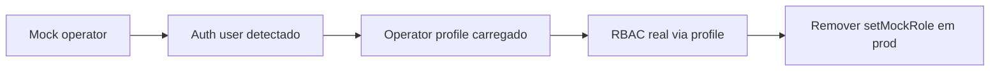

# Auth Foundation — Douglas AI Platform

> Status: Foundation v1.1  
> Sprint: 5.21 (+ login UI 5.25)  
> Escopo: sessão Supabase + login/logout mínimo — **RBAC mock permanece**.

## Objetivo

Estabelecer a camada de autenticação real (Supabase Auth) de forma **gradual**, sem quebrar o ambiente local sem env vars e **sem substituir** o `OperatorProvider` mock que governa RBAC hoje.

## Pacote `@douglas/supabase` — módulo auth

| Tipo | Função |
|------|--------|
| `AuthStatus` | `not_configured` \| `loading` \| `unauthenticated` \| `authenticated` \| `error` |
| `AuthMode` | `mock` \| `supabase_ready` \| `authenticated` |
| `AuthProviderKind` | `none` \| `supabase` |
| `AuthUser` | Usuário Supabase (`id`, `email`) |
| `AuthProfile` | Mapeamento de `operator_profiles` |
| `AuthRole` | `owner` \| `admin` \| `operator` \| `viewer` |
| `AuthSessionState` | Estado consolidado da sessão |
| `AuthAdapter` | Contrato para backends de auth |
| `createSupabaseAuthAdapter()` | Implementação Supabase |
| `AuthSessionProvider` | Provider React (dentro de `SupabaseProvider`) |
| `useAuthSession()` | Hook de consumo |
| `resolveAuthOperatorBridge()` | Ponte para migração com `OperatorProvider` |

## Comportamento por cenário

| Cenário | `AuthStatus` | `AuthMode` | RBAC efetivo |
|---------|--------------|------------|--------------|
| Sem env Supabase | `not_configured` | `mock` | Mock operator |
| Supabase OK, sem sessão | `unauthenticated` | `supabase_ready` | Mock operator (dev) |
| Sessão ativa (futuro) | `authenticated` | `authenticated` | **Ainda mock** nesta sprint |
| Erro de leitura de sessão | `error` | `supabase_ready` | Mock operator |

Headquarters **não quebra** em nenhum cenário acima.

### Detalhe: `supabase_ready`

Quando URL + anon key estão configurados mas não há JWT de sessão:

- O adapter consulta `auth.getSession()` (retorna vazio).
- O modo muda para `supabase_ready` — indica backend pronto para login futuro.
- `OperatorProvider` continua com `MOCK_OPERATORS` e `setMockRole` para desenvolvimento.

## Provider tree (Headquarters)

```
EventProvider
  └── SupabaseIntegration
        ├── SupabaseProvider
        └── AuthSessionProvider
              └── DemoDataIntegration
                    └── …
                          └── RuntimeIntegration
                                └── SecurityIntegration (OperatorProvider mock)
```

Widget técnico: `AuthStatusWidget` em `/headquarters`.

## Ponte Auth → Operator (migração gradual)

Hoje:

```
AuthSessionProvider ──(observa)──► Supabase Auth + operator_profiles
OperatorProvider    ──(governa)──► RBAC, confirmações, audit actor
```

Utilitário `resolveAuthOperatorBridge(session, mockRole)`:

- `effectiveRole` → sempre o mock nesta fase.
- `isUsingMockOperator` → sempre `true` nesta fase.
- `authProfileRole` → informativo quando profile ou `app_metadata.role` existir.

### Roadmap de migração



| Fase | Sprint alvo | Mudança |
|------|-------------|---------|
| 1 | **5.21 (atual)** | Sessão observada; mock RBAC |
| 2 | Futuro | Login UI + persistência de sessão browser |
| 3 | Futuro | `OperatorProvider` aceita `operator` de auth quando autenticado |
| 4 | Futuro | Desabilitar mock em production; RLS como fonte de verdade |

Hook Headquarters: `useAuthOperatorBridge()` combina `useAuthSession()` + `useOperator()`.

## Segurança

### Riscos mitigados nesta fase

- Sem env vars → nenhuma chamada auth de rede.
- Cliente browser com `persistSession: false` — não armazena JWT localmente ainda.
- Role de JWT lida apenas de `app_metadata.role`, nunca `user_metadata` (alinhado ao RLS).

### Riscos remanescentes

| Risco | Mitigação atual | Próximo passo |
|-------|-----------------|---------------|
| Mock admin em prod | Dev-only por design | Gate por `NODE_ENV` + auth obrigatório |
| Sessão não persistida | Login ainda não exposto | Habilitar persistência com login UI |
| Profile fetch falha silenciosamente | `profile: null`, continua mock | Telemetria + widget mostra gap |
| Audit actor = mock id | Documentado | Mapear `actor_id` para `auth.users.id` |

**Nunca** usar `service_role` no browser.

## Arquivos principais

| Caminho | Papel |
|---------|-------|
| `packages/supabase/src/auth/*` | Tipos, adapter, provider |
| `apps/headquarters/features/platform-supabase/SupabaseIntegration.tsx` | Wiring |
| `apps/headquarters/features/platform-auth/useAuthOperatorBridge.ts` | Ponte HQ |
| `apps/headquarters/components/widgets/AuthStatusWidget.tsx` | Widget técnico |
| `supabase/migrations/*operator_profiles*` | Schema de profile |

## Próximos passos

1. Login UI (email/OAuth) com `persistSession: true` em browser client.
2. Prop `operatorOverride` em `OperatorProvider` quando `mode === authenticated`.
3. Remover ou restringir `setMockRole` fora de development.
4. Correlacionar audit `actor_id` com UUID auth real.
5. Edge Function / service role para append de audit (RLS já preparado).

## Referências

- [auth-login-ui.md](./auth-login-ui.md) (Sprint 5.25)
- [Supabase Foundation](./supabase-foundation.md)
- [Supabase Schema & RLS](./supabase-schema-rls.md)
- [Safety & Permissions](./safety-permissions-architecture.md)
