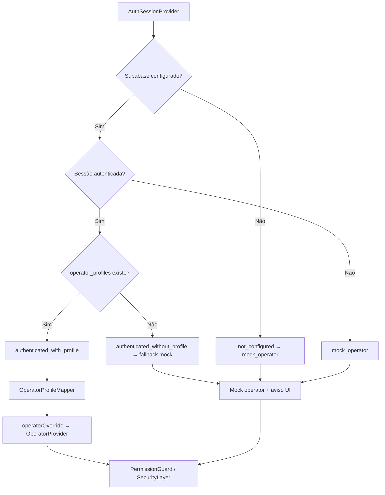

# Auth → Operator Handoff — Douglas AI Platform

> Status: Handoff v1 (Sprint 5.26)  
> Escopo: ponte gradual entre usuário autenticado e operador efetivo — **RBAC completo de produção ainda depende de RLS**.

## Objetivo

Quando há sessão Supabase autenticada, a plataforma deriva um **operador efetivo** a partir de `operator_profiles` e o injeta no `OperatorProvider`. Sem profile ou sem Supabase, o **mock operator** continua funcionando para desenvolvimento.

## Fluxo



## Estados de handoff

| Estado | Condição | RBAC efetivo | Fonte da role |
|--------|----------|--------------|---------------|
| `not_configured` | Sem env Supabase | Mock | `mock` |
| `mock_operator` | Supabase OK, sem sessão | Mock | `mock` |
| `authenticated_without_profile` | Login OK, sem row em `operator_profiles` | Mock (fallback) | `fallback` |
| `authenticated_with_profile` | Login OK + profile | Profile auth | `auth_profile` |
| `profile_error` | Erro de auth/sessão | Mock (fallback) | `fallback` |

## Módulos

### `@douglas/supabase/auth`

| Módulo | Função |
|--------|--------|
| `OperatorProfileMapper` | `AuthProfile` + `AuthUser` → `MappedOperator` |
| `OperatorFallbackPolicy` | Resolve handoff state e fonte da role |
| `EffectiveOperatorResolver` | Resolução completa incluindo `operatorOverride` |
| `resolveAuthOperatorBridge()` | API estável para widgets e hooks |

### `@douglas/security`

| Mudança | Descrição |
|---------|-----------|
| `OperatorProvider.operatorOverride` | Override opcional do operador mock |
| `OperatorProvider.operatorSource` | `mock` \| `auth_profile` \| `fallback` |
| `mockRoleChangeAllowed` | `false` em `NODE_ENV=production` |
| `isMockRoleChangeAllowed()` | Helper de ambiente |

### Headquarters

| Componente | Função |
|------------|--------|
| `AuthOperatorBridge` | Conecta auth session → `OperatorProvider` + eventos |
| `SecurityIntegration` | Usa `AuthOperatorBridge` em vez de `OperatorProvider` direto |
| `AuthStatusWidget` | Exibe handoff state, profile, operador efetivo, fonte da role |
| `RuntimeControlWidget` | Desabilita seletor mock em prod / quando profile ativo |

## Provider tree (atualizado)

```
EventProvider
  └── SupabaseIntegration
        ├── SupabaseProvider
        └── AuthSessionProvider
              └── …
                    └── SecurityIntegration
                          └── AuthOperatorBridge
                                └── OperatorProvider (+ operatorOverride)
                                      └── ActionConfirmationProvider
```

## Eventos internos

Publicados em transições de handoff (`source: authentication`):

| Tópico | Quando |
|--------|--------|
| `auth:operator:handoff_started` | Mudança de handoff state |
| `auth:operator:handoff_completed` | `authenticated_with_profile` |
| `auth:operator:handoff_fallback` | Fallback mock (sem profile ou após falha) |
| `auth:operator:handoff_failed` | `profile_error` |

Visíveis no **Event Monitor** e mapeados para **Audit Log** via `@douglas/audit`.

## Fallback mock

- **Dev sem Supabase:** comportamento idêntico ao Sprint 5.25 — mock operator com `setMockRole`.
- **Login sem profile:** sessão válida, RBAC permanece mock; widget exibe aviso de handoff.
- **Profile presente:** `PermissionGuard` usa role do profile; seletor mock desabilitado.

## Segurança e riscos

| Risco | Mitigação atual | Próximo passo |
|-------|-----------------|---------------|
| Escalada via mock role em prod | `setMockRole` bloqueado em production | Remover UI mock em prod |
| Profile ausente após login | Fallback mock + aviso | Bootstrap owner via service_role |
| Role só no client | Override local — **não substitui RLS** | Enforcement server-side |
| `user_metadata` como role | Não usado — apenas `operator_profiles` / `app_metadata` | Manter política |

**RBAC real de produção** ainda depende de:

1. Rows em `public.operator_profiles` com RLS ativo
2. `current_operator_role()` nas policies Postgres
3. Remoção completa do mock fora de development

## Criar primeiro owner em `operator_profiles`

Após aplicar migrations e criar usuário via Supabase Auth (Dashboard ou sign-up):

```sql
-- Executar com service_role ou SQL Editor (após auth.users existir)
INSERT INTO public.operator_profiles (user_id, display_name, role, status)
VALUES (
  '<uuid-do-auth.users>',
  'Platform Owner',
  'owner',
  'active'
);
```

O usuário deve fazer login novamente (ou `refreshSession`) para o handoff completar.

## Contratos públicos preservados

- `useAuthSession()`, `useOperator()`, `useAuthOperatorBridge()` — assinaturas estáveis
- `resolveAuthOperatorBridge()` — campos adicionais, sem breaking change em consumidores existentes
- Modo mock permanece disponível sem Supabase configurado

## Próximos passos (pós 5.26)

1. Edge Function ou trigger para provisionar profile no primeiro login
2. Sincronizar audit actor com `operator_profiles.id` em persistência Supabase
3. Desabilitar completamente mock UI quando `auth_profile` ativo em staging/prod
4. Testes de integração com Supabase local + seed de profile
