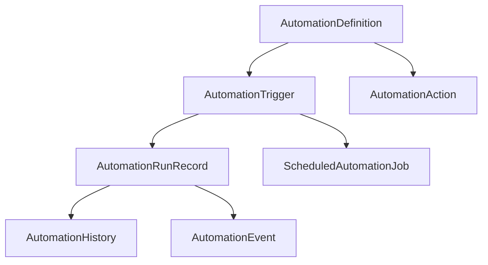
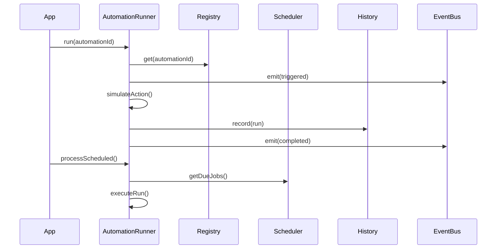

# Automation Engine Architecture — Douglas AI Platform

> Status: Foundation v0.1  
> Sprint: 3.4  
> Escopo: infraestrutura oficial de automações em `packages/automation/`.

## Objetivo

Criar a camada oficial de automações da Douglas AI Platform — disparadores, execução, agendamento e histórico.

Nesta sprint não há automação funcional, cron real, webhooks ativos ou chamadas API. A entrega é arquitetura pura com simulação explícita.

## Pacote

```
packages/automation/src/
├── AutomationTypes.ts       # Contratos centrais
├── AutomationTrigger.ts     # Cron, Webhook, Manual, API, Eventos
├── AutomationEvent.ts       # Event bus pub/sub
├── AutomationAction.ts      # Ações simuladas
├── AutomationHistory.ts     # Audit trail de execuções
├── AutomationScheduler.ts   # Agendamento (mock)
├── AutomationRegistry.ts    # Registro escalável
├── AutomationRunner.ts      # Orquestrador de execução
├── AutomationContext.ts
├── AutomationProvider.tsx
├── useAutomationEngine.ts
└── index.ts
```

## Tipos de Trigger Preparados

| Trigger | Tipo | Uso futuro |
|---------|------|------------|
| **Cron** | `cron` | pg_cron, node-cron, Edge Functions |
| **Webhook** | `webhook` | HTTP endpoints externos |
| **Manual** | `manual` | Disparo pelo usuário na UI |
| **API** | `api` | Chamadas REST internas |
| **Eventos internos** | `internal_event` | Pub/sub da plataforma |

`AutomationTriggerType` é extensível via `(string & {})`.

## Modelo de Dados



### AutomationDefinition

Unidade registrada: trigger + actions + metadata + status.

### AutomationRunner

Orquestra o ciclo:

1. `run()` — dispara automação;
2. `processScheduled()` — processa jobs vencidos;
3. `dispatchInternalEvent()` — reage a eventos internos;
4. `executeRun()` — simula actions, grava history, emite events.

### AutomationScheduler

Jobs agendados em memória:

- `schedule()` — cria job;
- `getDueJobs()` — retorna pendentes vencidos;
- `markDispatched()` — marca como processado.

Cron expressions armazenadas em `config.cron` — execução real em sprint futura.

### AutomationHistory

Audit trail imutável de cada run com snapshot completo.

### AutomationEventBus

Eventos: `automation:triggered`, `started`, `completed`, `failed`, `scheduled`.

Preparado para integrar Workflow Engine, Agent Framework e Memory Engine.

## Fluxo de Execução



## Definições na App

`features/automation-engine/definitions.ts` — 5 automações exemplo:

| Automação | Trigger | Departamento |
|-----------|---------|--------------|
| Relatório Diário | cron | financeiro |
| Webhook Lead CRM | webhook | crm |
| Publicação Manual YouTube | manual | youtube |
| Sync API Calma | api | calma |
| Evento Campanha Marketing | internal_event | marketing |

Nada hardcoded no pacote.

## Integração

```tsx
<AutomationProvider automations={automationDefinitions}>
  <WorkflowProvider>...</WorkflowProvider>
</AutomationProvider>
```

Hook: `useAutomationEngine()`.

```ts
runAutomation({ automationId: "automation:manual-youtube" });
dispatchInternalEvent({ eventName: "marketing:campaign:launched" });
processScheduled();
```

## Relação com Workflow Engine

| Camada | Pacote | Papel |
|--------|--------|-------|
| Automação | `@douglas/automation` | Quando disparar, triggers, schedule |
| Workflow | `@douglas/workflow` | Como executar fluxos multi-step |

Action `invoke_workflow` preparada para conectar os dois no futuro.

## Decisões Arquiteturais

### Simulação explícita

Actions retornam `status: "simulated"`. Zero efeitos colaterais.

### Runner sem React

Testável, substituível por worker/cron service.

### Scheduler desacoplado

Hoje in-memory. Futuro: Supabase pg_cron ou BullMQ sem alterar Runner interface.

### Event bus interno

`internal_event` triggers reagem via `dispatchInternalEvent`. Desacopla produtores de consumidores.

### Registry O(1)

Centenas de automações com lookup constante e filtros por trigger/department.

### History com snapshot

Cada run preservado integralmente para audit e debugging.

## Escalabilidade

- **Registry** — Map indexado, filtros por trigger type e department;
- **Scheduler** — fila ordenada por `scheduledFor`, processamento batch;
- **Event bus** — pub/sub extensível para novos event types;
- **Actions plugáveis** — futuro registry de handlers reais;
- **Multi-tenant** — `metadata.workspaceId` preparado para RLS;
- **Trigger extensível** — novos tipos sem breaking changes.

## Evolução Futura

- Cron real via pg_cron ou node-cron worker;
- Webhook HTTP endpoints com validação de assinatura;
- API routes Next.js conectadas ao Runner;
- Action handlers reais (notify, invoke_workflow, invoke_agent);
- Persistência Supabase;
- Dead letter queue para falhas;
- Rate limiting por automação;
- UI de gerenciamento de automações;
- Integração com `@douglas/workflow` e `@douglas/agents`.

## O que não foi implementado

- Cron funcional;
- Webhooks HTTP;
- API endpoints;
- Notificações reais;
- Persistência remota;
- UI dedicada.
