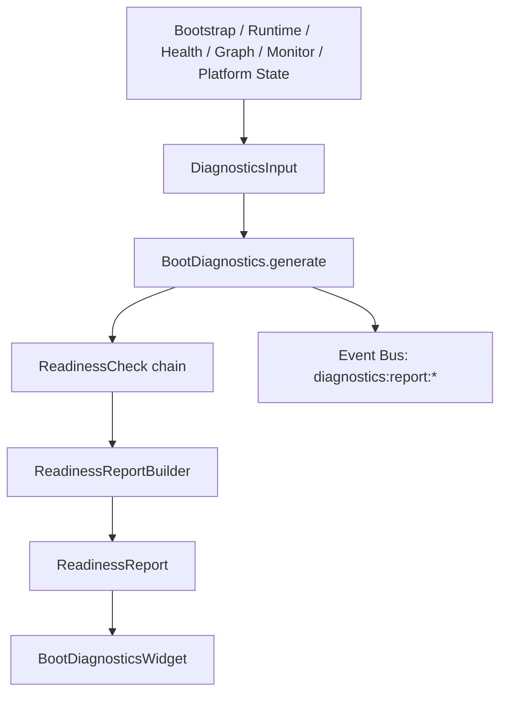

# Boot Diagnostics Architecture — Douglas AI Platform

> Status: Foundation v1.0  
> Sprint: 5.7  
> Escopo: diagnóstico operacional de boot e readiness.

## Objetivo

Responder à pergunta operacional: **"A plataforma está pronta para operar?"**

O sistema agrega sinais de Bootstrap, Runtime, Health Engine, Dependency Graph, Event Monitor e Platform State em um **`ReadinessReport`** único, com score, status, issues, warnings e recomendações.

## Pacote `@douglas/diagnostics`

```
packages/diagnostics/src/
├── DiagnosticsTypes.ts           # Tipos: ReadinessReport, DiagnosticIssue, etc.
├── DiagnosticIssue.ts            # Factory de issues
├── DiagnosticRecommendation.ts   # Factory de recomendações
├── ModuleStartupDiagnostic.ts    # Diagnóstico por módulo (bootstrap + runtime + health)
├── StartupTimeline.ts            # Timeline ordenada do boot
├── ReadinessReport.ts            # ReadinessCheck + ReadinessReportBuilder
├── BootDiagnostics.ts            # Orquestrador + publicação de eventos
├── DiagnosticsContext.ts
├── DiagnosticsProvider.tsx
└── useBootDiagnostics.ts
```

**Decisão:** `@douglas/diagnostics` **não importa** outros pacotes `@douglas/*`. A integração com hooks vive em `apps/headquarters/features/platform-diagnostics/`.

## Fluxo de diagnóstico



1. `BootDiagnosticsIntegration` monta `DiagnosticsInput` a partir dos hooks da plataforma.
2. `DiagnosticsProvider` chama `BootDiagnostics.generate()` na montagem e a cada 15s.
3. `BootDiagnostics` publica eventos no Event Bus antes/depois da geração.
4. Widgets e outros consumidores usam `useBootDiagnostics()`.

## Dados analisados

| Fonte | O que entra no diagnóstico |
|-------|---------------------------|
| **Bootstrap** | Módulos carregados, status, `bootDurationMs`, timeline |
| **Runtime** | Módulos ativos, `isRunning`, `isStarting` |
| **Health Engine** | Contagens critical/warning, status por módulo |
| **Dependency Graph** | Ciclos, dependências críticas indisponíveis, issues |
| **Event Monitor** | Eventos critical/error recentes (últimos 5) |
| **Platform State** | `readinessScore`, `blockers` como baseline |

## ReadinessReport

```ts
interface ReadinessReport {
  ready: boolean;              // true quando status=ready, bootstrap ready, runtime running, sem críticos
  score: number;               // 0–100 (baseline platform score − penalidades)
  status: "ready" | "degraded" | "not_ready";
  criticalIssues: DiagnosticIssue[];
  warnings: DiagnosticIssue[];
  recommendations: DiagnosticRecommendation[];
  moduleDiagnostics: ModuleStartupDiagnostic[];
  startupTimeline: StartupTimeline;
  recentCriticalEvents: DiagnosticRecentEvent[];
  generatedAt: string;
}
```

### Interpretação do readiness

| Status | Score típico | Significado |
|--------|--------------|-------------|
| `ready` | ≥ 80, sem críticos | Plataforma operacional |
| `degraded` | 50–79 ou warnings | Operável com ressalvas |
| `not_ready` | < 50 ou críticos | Não operar até resolver blockers |

Penalidades principais:

- Bootstrap não pronto: −30 a −50
- Runtime parado: −25
- Health critical: −5 por módulo
- Ciclos no grafo: −20
- Eventos critical recentes: −5 cada

## ReadinessCheck — extensão por módulos

Implemente a interface `ReadinessCheck`:

```ts
interface ReadinessCheck {
  id: string;
  name: string;
  evaluate(input: DiagnosticsInput): {
    issues: DiagnosticIssue[];
    warnings: DiagnosticIssue[];
    recommendations: DiagnosticRecommendation[];
    scorePenalty: number;
  };
}
```

Checks padrão (`DEFAULT_READINESS_CHECKS`):

- `BootstrapReadinessCheck`
- `RuntimeReadinessCheck`
- `HealthReadinessCheck`
- `DependencyGraphReadinessCheck`
- `EventMonitorReadinessCheck`

Para adicionar um check customizado na app:

```tsx
<DiagnosticsProvider
  input={input}
  diagnostics={new BootDiagnostics({
    checks: [...DEFAULT_READINESS_CHECKS, new MyModuleReadinessCheck()],
    publish: publishDiagnosticEvent,
  })}
/>
```

## Event Bus

Tópicos publicados ao gerar diagnóstico:

| Tópico | Quando |
|--------|--------|
| `diagnostics:report:started` | Início da geração |
| `diagnostics:report:completed` | Sucesso — inclui `score`, `status`, `durationMs` |
| `diagnostics:report:failed` | Erro durante geração |

Categoria: `diagnostics`. Publisher: `core`. Subscribers registrados: `analytics`, `monitor`, `health`.

## Integração Headquarters

### Provider tree (atualizado)

```
HealthProvider
└── PlatformStateIntegration
    └── BootDiagnosticsIntegration   ← Sprint 5.7
        └── (domínios / páginas)
```

### Widget

`BootDiagnosticsWidget` exibe:

- Readiness score e status geral
- Problemas críticos e alertas
- Recomendações
- Tempo de boot e timeline de módulos
- Eventos críticos recentes

## Arquivos criados/alterados (Sprint 5.7)

| Arquivo | Ação |
|---------|------|
| `packages/diagnostics/**` | Novo pacote |
| `packages/events/src/TypedEvents.ts` | Tópicos `diagnostics:report:*` |
| `apps/headquarters/features/platform-diagnostics/**` | Integração |
| `apps/headquarters/features/platform-health/HealthIntegration.tsx` | Wiring do provider |
| `apps/headquarters/components/widgets/BootDiagnosticsWidget.tsx` | Widget |
| `apps/headquarters/components/routing/HeadquartersPage.tsx` | Card do widget |
| `apps/headquarters/features/events/registry.ts` | Definições de eventos |
| `apps/headquarters/features/platform-monitor/event-bus-bridge.ts` | Mensagens no monitor |
| `apps/headquarters/package.json` | Dependência `@douglas/diagnostics` |
| `apps/headquarters/next.config.ts` | `transpilePackages` |
