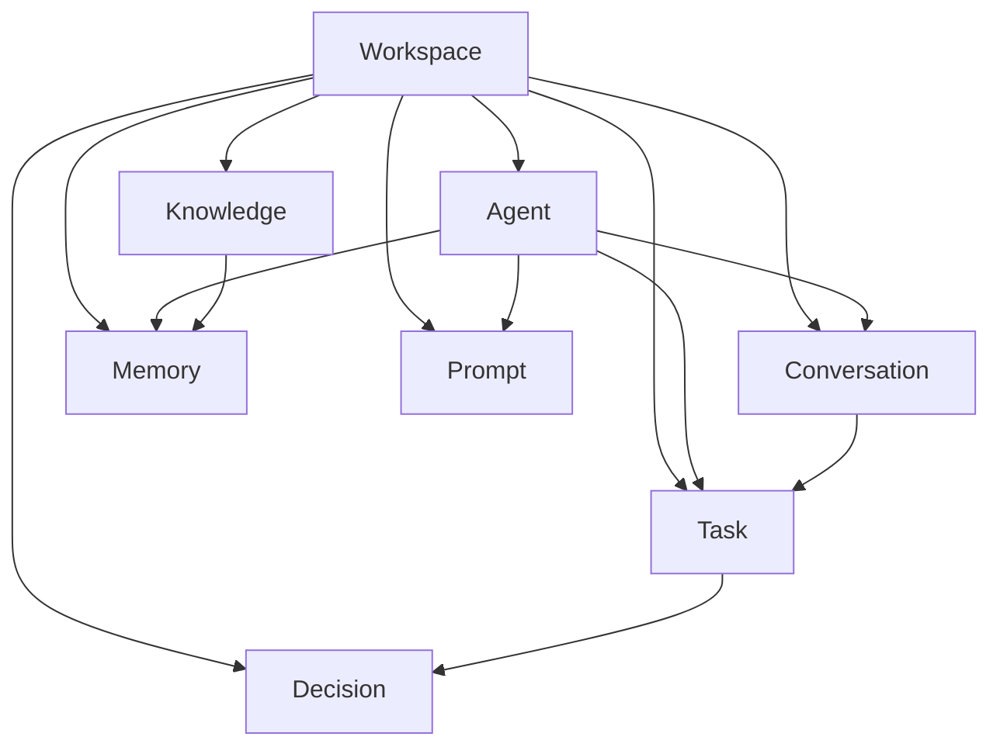

# Brain Architecture — Douglas AI Platform

> Status: Foundation v0.1  
> Sprint: 3.0  
> Escopo: infraestrutura do núcleo cognitivo em `apps/headquarters/features/brain/`.

## Objetivo

O Douglas Brain é o núcleo da plataforma. Ele organiza os domínios que sustentarão inteligência operacional, memória, conhecimento e orquestração de agentes.

Nesta sprint não há IA, modelos, APIs externas, Supabase ou persistência real. A entrega é a arquitetura local com mocks, providers e contratos TypeScript.

## Domínios

| Domínio | Responsabilidade |
|---------|------------------|
| **Workspace** | Fronteira operacional — agrupa agentes, tarefas e conhecimento |
| **Agent** | Definição de agentes com capacidades e prompts padrão |
| **Conversation** | Threads de mensagens entre usuário e agentes |
| **Memory** | Fatos, preferências, contexto e resumos por escopo |
| **Prompt** | Templates versionados com variáveis |
| **Task** | Trabalho delegado a agentes |
| **Decision** | Decisões propostas, aprovadas ou executadas |
| **Knowledge** | Base documental indexável |

## Estrutura de Pastas

```
apps/headquarters/features/brain/
├── types/                  # Interfaces TypeScript por domínio
│   ├── conversation.ts
│   ├── agent.ts
│   ├── memory.ts
│   ├── workspace.ts
│   ├── prompt.ts
│   ├── task.ts
│   ├── decision.ts
│   ├── knowledge.ts
│   └── index.ts
├── mocks/                  # Dados mockados por domínio
├── workspace/              # Context + Provider + Hook
├── agent/
├── conversation/
├── memory/
├── prompt/
├── task/
├── decision/
├── knowledge/
├── BrainContext.ts         # Estado agregado cross-domain
├── BrainProvider.tsx       # Composição de todos os providers
├── useBrain.ts             # Hook raiz + useBrainDomains
├── BrainOverview.tsx       # UI mínima de status
├── BrainPanel.tsx          # Composição da rota /brain
└── index.ts
```

Cada domínio segue o padrão:

```
{domain}/
├── {Domain}Context.ts
├── {Domain}Provider.tsx
└── use{Domain}.ts
```

## Camadas

### Types

Contratos estáveis que não dependem de React. Preparados para serialização futura (Supabase, API REST, Edge Functions).

`BrainAgent` usa prefixo para não conflitar com `Agent` do dashboard em `lib/mock-data.ts`.

### Mocks

Fonte local de dados em `mocks/`. Cada provider inicializa estado a partir dos mocks. A migração futura substitui mocks por repositórios sem alterar interfaces.

### Domain Providers

Cada provider:

- mantém lista de entidades do domínio;
- expõe seleção ativa (`activeXId`, `activeX`);
- oferece helpers (`getXById`, `getXByWorkspace`).

Nenhum provider faz chamadas externas.

### BrainProvider

Compõe todos os domain providers e expõe `BrainContext` com:

- `isReady` — infraestrutura inicializada;
- `activeWorkspaceId` — workspace ativo;
- `domainCounts` — contagem por domínio no workspace ativo.

Ordem de composição:

```tsx
WorkspaceProvider
  → AgentProvider
    → MemoryProvider
      → KnowledgeProvider
        → PromptProvider
          → ConversationProvider
            → TaskProvider
              → DecisionProvider
                → BrainContextBridge
```

`Workspace` é a fronteira primária. Demais domínios filtram por `workspaceId`.

### Hooks

| Hook | Uso |
|------|-----|
| `useBrain()` | Estado agregado (ready, counts, workspace ativo) |
| `useBrainDomains()` | Acesso unificado a todos os domínios + listas filtradas |
| `useWorkspace()` | Workspaces e seleção |
| `useAgent()` | Agentes do Brain |
| `useConversation()` | Conversas e mensagens |
| `useMemory()` | Memória contextual |
| `usePrompt()` | Templates de prompt |
| `useTask()` | Tarefas |
| `useDecision()` | Decisões |
| `useKnowledge()` | Base de conhecimento |

## Integração

`AppShell` envolve a aplicação:

```tsx
<SearchProvider>
  <BrainProvider>
    <CommandPaletteProvider>
      ...
    </CommandPaletteProvider>
  </BrainProvider>
</SearchProvider>
```

A rota `/brain` renderiza `BrainRoutePage` → `BrainPanel`:

- `BrainOverview` — status dos domínios;
- `SearchPanel` — Search Engine (Sprint 2.9, feature separada).

Search Engine e Brain são features independentes que coexistem na rota Brain.

## Relações entre Domínios



## Decisões Arquiteturais

### Domínios modulares

Cada domínio é independente. Evolução de `Task` não exige alterar `Knowledge`.

### Workspace como fronteira

Multi-tenant futuro e isolamento por produto (Douglas OS, Calma) começam no workspace.

### BrainAgent vs Agent do dashboard

O widget `AgentsWidget` usa `Agent` operacional simples. O Brain define `BrainAgent` com capacidades, prompts e workspace — conceitos distintos.

### Sem IA nesta sprint

Providers expõem leitura e seleção. Mutations, streaming e inferência serão camadas futuras (`BrainOrchestrator`, `InferenceAdapter`).

### Mocks explícitos

Dados em `mocks/` tornam visível o contrato esperado antes de Supabase.

## Preparação para Supabase

Migração planejada por domínio:

| Domínio | Tabela sugerida | Notas |
|---------|-----------------|-------|
| Workspace | `brain_workspaces` | RLS por organização |
| Agent | `brain_agents` | FK workspace |
| Conversation | `brain_conversations` | FK workspace, agent |
| Memory | `brain_memories` | TTL via `expires_at`, pgvector opcional |
| Prompt | `brain_prompts` | Versionamento |
| Task | `brain_tasks` | Status workflow |
| Decision | `brain_decisions` | Audit trail |
| Knowledge | `brain_knowledge` | Full-text + embeddings |

Padrão de migração:

```
Hoje:  mock → Provider → Hook → UI
Futuro: SupabaseRepository → Provider → Hook → UI
```

Repositories implementarão a mesma interface que os mocks expõem hoje.

## Evolução Futura

### Sprint 3.1 — Orchestrator

Camada `BrainOrchestrator` que conecta Conversation → Agent → Prompt → Task sem IA real (fluxo determinístico).

### Sprint 3.2 — Inference Adapter

Interface `InferenceProvider` com implementações mock e real (OpenAI, Anthropic, local).

### Sprint 3.3 — Memory Engine

Consolidação automática de memória de sessão → workspace. Integração com pgvector.

### Sprint 3.4 — Knowledge Retrieval

RAG sobre `Knowledge` + documentação. Integração com Search Engine.

### Sprint 3.5 — Real-time

Supabase Realtime para conversas e status de agentes.

### Sprint 3.6 — Command Palette + Brain

Unificar busca rápida com domínios do Brain (agentes, tarefas, decisões).

## O que não foi implementado

- Chamadas a APIs ou modelos de IA;
- Persistência (localStorage, Supabase);
- Autenticação e RLS;
- Mutations (create/update/delete);
- Streaming de mensagens;
- UI completa por domínio (apenas overview arquitetural).
