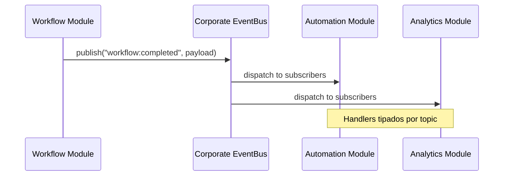

# Corporate Event Bus Architecture — Douglas AI Platform

> Status: Foundation v0.1  
> Sprint: 3.6  
> Escopo: barramento corporativo tipado em `packages/events/`.

## Objetivo

Permitir comunicação tipada entre todos os módulos da Douglas AI Platform via Event Bus corporativo.

Nesta sprint não há WebSocket, API, persistência ou integração em tempo real. A entrega é arquitetura pura com TypeScript fortemente tipado.

## Pacote

```
packages/events/src/
├── TypedEvents.ts        # DouglasEventMap — mapa central tipado
├── Event.ts              # Entidade Event + factory
├── EventHandler.ts       # Handlers tipados
├── EventSubscriber.ts    # Subscrições
├── EventPublisher.ts     # Publicação tipada
├── EventRegistry.ts      # Registro de definições
├── EventBus.ts           # Orquestrador corporativo
├── EventContext.ts
├── EventProvider.tsx
├── useEventBus.ts
└── index.ts
```

## Relação com Douglas Core (Sprint 3.5)

| Camada | Pacote | Papel |
|--------|--------|-------|
| Core EventBus | `@douglas/core` | Lifecycle de módulos, strings genéricas |
| Corporate EventBus | `@douglas/events` | Comunicação inter-módulo tipada |

Integração futura: bridge que republica eventos do Core no bus corporativo.

## Tipagem Forte

### DouglasEventMap

Mapa central que associa cada topic ao seu payload:

```ts
interface DouglasEventMap {
  "workflow:started": WorkflowStartedPayload;
  "automation:triggered": AutomationTriggeredPayload;
  "calma:session:started": CalmaSessionStartedPayload;
  // ...
}

type EventTopic = keyof DouglasEventMap;
type EventPayload<TTopic> = DouglasEventMap[TTopic];
```

`publish` e `subscribe` inferem tipos automaticamente:

```ts
publish("workflow:started", "workflow", {
  workflowId: "workflow:youtube-publish",
  executionId: "exec:123",
}); // ✅ tipado

publish("workflow:started", "workflow", {
  invalid: true,
}); // ❌ erro de compilação
```

### Event

```ts
interface Event<TTopic extends EventTopic> {
  id: string;
  topic: TTopic;
  category: EventCategory;
  source: EventSource;
  payload: DouglasEventMap[TTopic];
  metadata: EventMetadata;
  createdAt: string;
}
```

## Categorias de Eventos

| Categoria | Topics | Exemplos |
|-----------|--------|----------|
| **internal** | module loaded/ready | Bootstrap de módulos |
| **system** | platform ready, health | Saúde da plataforma |
| **ai** | inference requested/completed | Agentes e LLMs |
| **workflow** | started, completed | Workflow Engine |
| **automation** | triggered, completed | Automation Engine |
| **calma** | session, mindfulness | Produto Calma |
| **youtube** | upload, published | YouTube Studio |

## Componentes

### EventRegistry

Registra metadados de cada topic:

- `category`, `description`, `version`
- `publishers[]` — quem pode publicar
- `subscribers[]` — quem deve escutar

Contrato documental — enforcement real em sprint futura.

### EventPublisher

Publicação tipada. Cria `Event<TTopic>` e despacha via subscriber.

### EventSubscriber

- `subscribe(topic, handler)` — handler recebe `Event<TTopic>` tipado
- `subscribeMany(topics, handler)`
- `subscribeAll(handler)`

### EventBus

Orquestra registry + publisher + subscriber + histórico:

- `publish()` — publica e registra histórico
- `subscribe()` / `subscribeCategory()` — escuta por topic ou categoria
- `getHistory()` / `getHistoryByCategory()`

## Como Novos Módulos Publicam Eventos

### Passo 1 — Estender DouglasEventMap

Via module augmentation em `types/events.d.ts` do módulo:

```ts
declare module "@douglas/events" {
  interface DouglasEventMap {
    "crm:lead:created": {
      leadId: string;
      source: string;
    };
  }
}
```

Ou adicionar diretamente em `TypedEvents.ts` durante desenvolvimento do módulo.

### Passo 2 — Registrar no EventRegistry

Em `features/events/registry.ts` (ou registry do módulo):

```ts
defineEvent(
  "crm:lead:created",
  "Novo lead criado no CRM",
  ["crm"],
  ["analytics", "notifications", "automation"],
);
```

Adicionar topic em `EVENT_CATEGORIES` e `TOPIC_CATEGORY`.

### Passo 3 — Publicar via useEventBus

```ts
const { publish } = useEventBus();

publish("crm:lead:created", "crm", {
  leadId: "lead:123",
  source: "website",
});
```

TypeScript valida topic, source e payload em compile time.

### Passo 4 — Escutar em outro módulo

```ts
const { subscribe } = useEventBus();

useEffect(() => {
  return subscribe("crm:lead:created", (event) => {
    // event.payload.leadId — tipado
  });
}, [subscribe]);
```

### Passo 5 — Escutar categoria inteira

```ts
subscribeCategory("automation", (event) => {
  // todos os eventos automation:*
});
```

## Fluxo de Comunicação



Nenhum módulo importa outro. Apenas `@douglas/events`.

## Integração

```tsx
<CoreProvider modules={...}>
  <EventProvider definitions={corporateEventDefinitions}>
    <SearchProvider>...</SearchProvider>
  </EventProvider>
</CoreProvider>
```

Definições: `features/events/registry.ts` — 14 topics registrados.

Hook: `useEventBus()`.

## Decisões Arquiteturais

### Pacote separado de Core

Core gerencia lifecycle. Events gerencia comunicação tipada. Responsabilidades distintas.

### DouglasEventMap como single source of truth

Todo topic e payload definidos centralmente. Extensível via augmentation.

### Category + Topic

Category agrupa topics para `subscribeCategory`. Topic identifica evento específico.

### EventMetadata

`correlationId`, `causationId` preparados para tracing distribuído futuro.

### Sem WebSocket/API

Bus in-process. Persistência e transporte em sprints futuras.

### Histórico in-memory

Debugging e replay local. Supabase event store no futuro.

## Escalabilidade

- **Topics extensíveis** — module augmentation sem alterar core do bus
- **Registry** — documentação viva de publishers/subscribers
- **Category subscriptions** — escutar domínios inteiros
- **Typed handlers** — refactor-safe, IDE autocomplete
- **EventBus puro** — migrável para worker/message queue mantendo interface

## Evolução Futura

- Bridge Core EventBus → Corporate EventBus
- Supabase event store + replay
- Schema validation runtime (Zod)
- Dead letter queue
- Event versioning e migration
- OpenTelemetry correlation via metadata
- Outbox pattern para integrações externas

## O que não foi implementado

- WebSocket ou SSE
- API REST de eventos
- Persistência remota
- Schema validation runtime
- Permission enforcement em publishers
