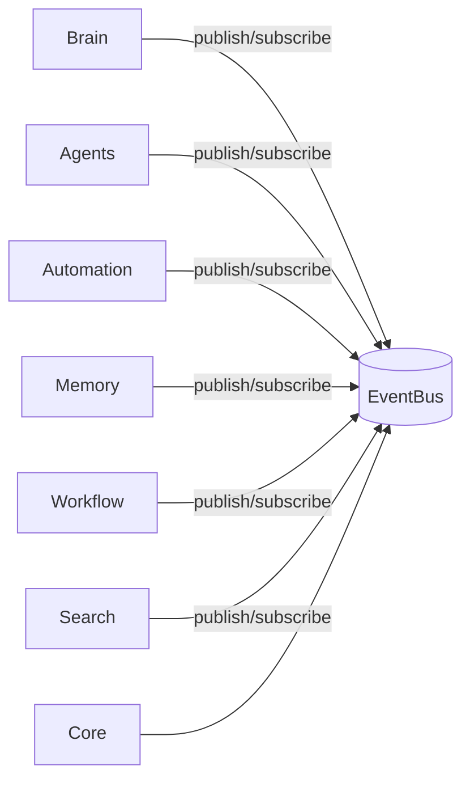

# Douglas Core Architecture — Douglas AI Platform

> Status: Foundation v0.1  
> Sprint: 3.5  
> Escopo: núcleo oficial da plataforma em `packages/core/`.

## Objetivo

Criar o núcleo que conecta todos os módulos da Douglas AI Platform sem acoplamento direto entre eles.

Toda comunicação inter-módulo ocorre via **EventBus**. Nenhum módulo importa outro diretamente — Inversão de Dependência.

Nesta sprint não há funcionalidades reais. A entrega é arquitetura pura.

## Pacote

```
packages/core/src/
├── CoreTypes.ts           # Módulos, eventos, health
├── Config.ts              # Configuração key-value
├── Environment.ts         # dev / staging / production
├── Version.ts             # Versão da plataforma e core
├── Logger.ts              # Logging estruturado
├── EventBus.ts            # Barramento central de eventos
├── ServiceContainer.ts    # Inversão de dependência (DI)
├── CoreServiceTokens.ts   # Tokens de serviços core
├── ModuleRegistry.ts      # Registro de módulos
├── ModuleLoader.ts        # Carregamento ordenado por deps
├── HealthCheck.ts         # Saúde da plataforma
├── CoreEngine.ts          # Orquestrador principal
├── CoreContext.ts
├── CoreProvider.tsx
├── useCore.ts
└── index.ts
```

## Módulos Registráveis

| Módulo | ID | Pacote |
|--------|-----|--------|
| Brain | `brain` | app feature |
| Agents | `agents` | `@douglas/agents` |
| Automation | `automation` | `@douglas/automation` |
| Memory | `memory` | `@douglas/memory` |
| Workflow | `workflow` | `@douglas/workflow` |
| Search | `search` | app feature |
| Notifications | `notifications` | futuro |
| Analytics | `analytics` | futuro |
| Authentication | `authentication` | futuro |

Definições em `apps/headquarters/features/core/modules.ts` — nada hardcoded no pacote core.

## Princípio: Comunicação via EventBus



Módulos **não** se referenciam diretamente. Declaram `events.publishes` e `events.subscribes` como contrato documental.

Exemplo de tópicos:

- `workflow:completed` → Automation escuta
- `memory:written` → Brain escuta
- `core:platform:ready` → todos escutam

## Inversão de Dependência

### ServiceContainer

Registro e resolução via tokens tipados:

```ts
const eventBus = container.resolve(CoreServiceTokens.eventBus);
```

Serviços core registrados automaticamente:

- `core.eventBus`
- `core.logger`
- `core.config`
- `core.registry`
- `core.version`
- `core.environment`

Módulos futuros registram serviços via token sem expor implementação.

### ModuleLoader

Ordem de carregamento via topological sort em `dependencies[]`:

```
authentication → memory → agents → workflow → automation → brain → search → notifications → analytics
```

Emite eventos: `core:module:loading` → `loaded` → `ready`.

## CoreEngine

Orquestra:

1. **bootstrap(modules)** — registra, carrega, emite `core:platform:ready`;
2. **publish / subscribe** — delega ao EventBus;
3. **getModule(id)** — consulta registry;
4. **getHealthReport()** — health check de todos os módulos.

## Componentes de Infraestrutura

| Componente | Responsabilidade |
|----------|------------------|
| **Config** | Configuração runtime mergeable |
| **Environment** | dev/staging/prod, debug, apiBaseUrl |
| **Version** | platform + core + build |
| **Logger** | Logs estruturados com níveis |
| **HealthCheck** | healthy / degraded / unhealthy por módulo |

## Integração

```tsx
<CoreProvider modules={coreModuleDefinitions} platformVersion="0.1">
  <SearchProvider>
    <AutomationProvider>
      <WorkflowProvider>
        <MemoryProvider>
          <AgentProvider>
            <BrainProvider>
              ...
            </BrainProvider>
          </AgentProvider>
        </MemoryProvider>
      </WorkflowProvider>
    </AutomationProvider>
  </SearchProvider>
</CoreProvider>
```

Core envolve todos os providers existentes — **preserva** arquitetura anterior.

Hook: `useCore()`.

```ts
const { publish, subscribe, getModule, healthReport } = useCore();

subscribe("workflow:completed", (event) => {
  publish("analytics:event:recorded", "analytics", { topic: event.topic });
});
```

## Decisões Arquiteturais

### Core não importa módulos

`@douglas/core` não depende de `@douglas/agents`, `@douglas/memory`, etc. A app declara módulos via definitions. Core permanece agnóstico.

### EventBus central vs buses locais

Automation e Agents possuem event buses locais (Sprint 3.1/3.4). Core EventBus é o barramento **da plataforma**. Integração futura: bridges que republicam eventos locais no bus central.

### Module definitions como contrato

Cada módulo declara `publishes` e `subscribes`. Documenta integração sem acoplamento de código.

### Topological load order

Dependencies controlam ordem de bootstrap. Authentication primeiro, Analytics por último.

### HealthCheck agregado

Status por módulo + status geral. Preparado para dashboards de observabilidade.

### Providers existentes preservados

Core não substitui BrainProvider, AgentProvider, etc. Adiciona camada de orquestração acima.

## Escalabilidade

- **Registry O(1)** — centenas de módulos;
- **EventBus pub/sub** — desacoplamento total;
- **ServiceContainer** — DI extensível;
- **ModuleLoader** — DAG de dependências;
- **Config/Environment** — multi-tenant futuro;
- **Logger + HealthCheck** — observabilidade;
- **Topics extensíveis** — novos eventos sem breaking changes.

## Evolução Futura

- Event bridges entre buses locais e Core EventBus;
- Module adapters que implementam lifecycle hooks reais;
- Supabase para event sourcing;
- Authentication module integrado;
- Notifications e Analytics como pacotes;
- Worker process consumindo EventBus;
- OpenTelemetry via Logger;
- API `/health` usando HealthCheck.

## O que não foi implementado

- Funcionalidades reais dos módulos;
- Event bridges automáticos;
- Persistência de eventos;
- Auth, Notifications, Analytics runtime;
- Substituição dos providers existentes.
