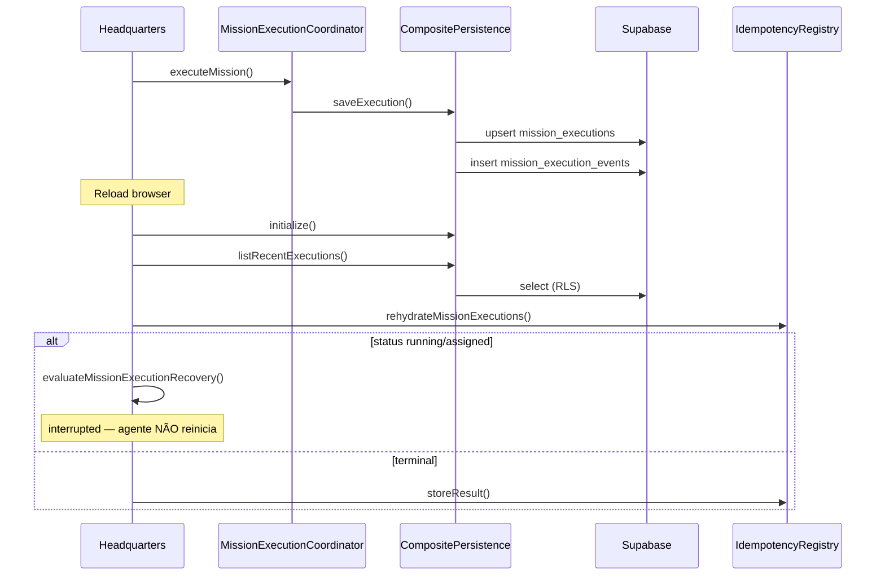

# Persistence Rehydration Lifecycle

Ciclo de vida da persistência de execuções de missão — da gravação remota à reidratação após reload.

## Fluxo

## Componentes

| Componente | Responsabilidade |
|------------|------------------|
| `rehydrateMissionExecutions` | Lista execuções, aplica recovery, registra no registry |
| `MissionExecutionRecoveryPolicy` | running/assigned → interrupted/recovery_required |
| `CompositeMissionExecutionPersistence` | Supabase + fallback session (dev only) |
| `AgentExecutionHistoryRepository` | Histórico e métricas por agentId |

## Recovery após reload

Execuções **running** ou **assigned** encontradas após reload:

- **Não** reiniciam o agente automaticamente
- Viram `interrupted` (default) ou `recovery_required`
- Emitem `mission:recovery_required` quando aplicável
- Ação manual necessária (Sprint 5.55 não implementa auto-continue)

## Acceptance staging (Sprint 5.55)

A **Staging Persistence Acceptance** prova o ciclo completo:

1. Executar missão acceptance
2. Persistir remotamente
3. Reload / reidratação
4. Restaurar timeline e histórico
5. Recalcular métricas
6. Confirmar agente não reexecutado

Ver [staging-persistence-acceptance.md](../operations/staging-persistence-acceptance.md).

## Development vs staging

| Ambiente | Modo | Fallback | Reidratação |
|----------|------|----------|-------------|
| development | `supabase_preferred` | sessionStorage permitido | session + supabase |
| staging | `supabase_required` | blocker | supabase only |

## Referências

- [mission-persistence.md](./mission-persistence.md)
- [mission-execution-schema.md](../database/mission-execution-schema.md)
