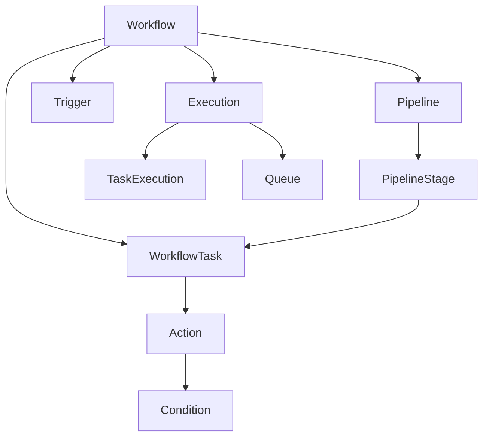
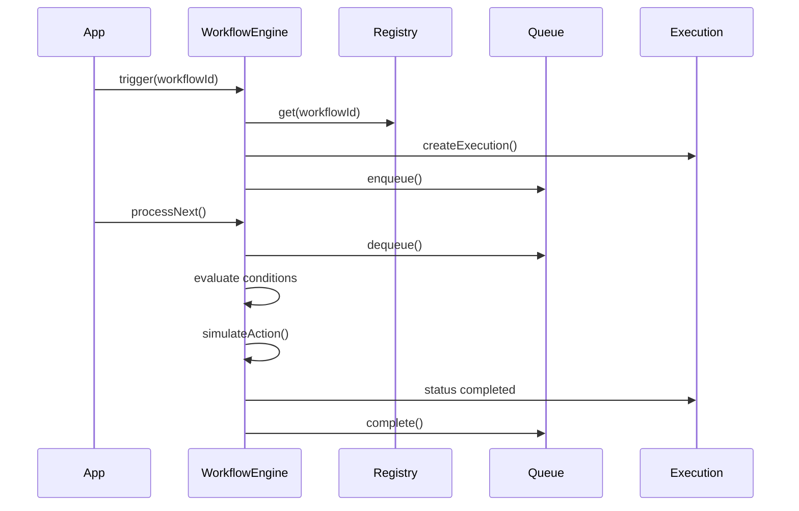

# Workflow Engine Architecture — Douglas AI Platform

> Status: Foundation v0.1  
> Sprint: 3.3  
> Escopo: engine de fluxos departamentais em `packages/workflow/`.

## Objetivo

Permitir que departamentos executem fluxos automaticamente — YouTube, Calma, Marketing, Financeiro, CRM e futuros.

Nesta sprint não há automação real, filas externas, cron jobs ou integrações. A entrega é a arquitetura: tipos, registry, engine, queue, provider e contratos de extensão.

## Pacote

```
packages/workflow/src/
├── WorkflowTypes.ts      # Contratos centrais
├── Workflow.ts           # Definição de fluxo
├── Pipeline.ts           # Estágios ordenados
├── Task.ts               # Tarefas com dependências
├── Trigger.ts            # Disparadores
├── Condition.ts          # Regras condicionais
├── Action.ts             # Ações (simuladas)
├── Execution.ts          # Runtime de execução
├── Queue.ts              # Fila priorizada
├── WorkflowRegistry.ts   # Registro escalável
├── WorkflowEngine.ts     # Orquestrador
├── WorkflowContext.ts
├── WorkflowProvider.tsx
├── useWorkflowEngine.ts
└── index.ts
```

## Modelo de Dados



### Workflow

Unidade principal. Agrupa pipeline, tasks, triggers e metadata por departamento.

### Pipeline

Sequência de estágios. Cada estágio referencia task IDs em ordem.

### Task

Unidade de trabalho com:
- `actions[]` — o que executar;
- `dependsOn[]` — dependências entre tasks;
- `order` — ordem explícita.

### Trigger

Inicia execuções: `manual`, `schedule`, `event`, `webhook` (extensível).

### Condition

Avalia contexto antes de executar actions:

- `equals`, `not_equals`, `contains`, `greater_than`, `less_than`.

### Action

Operação atômica. Nesta sprint: `simulateAction()` — sem efeitos reais.

Tipos preparados: `notify`, `assign_agent`, `update_record`, `invoke_workflow`, `log`.

### Execution

Instância runtime de um workflow. Contém `taskExecutions[]` e `context`.

### Queue

Fila priorizada de execuções:

- `enqueue` → `dequeue` → `complete`;
- ordenação por `priority` desc, depois FIFO.

## Fluxo de Execução



## Departamentos Preparados

| Departamento | ID | Workflow exemplo |
|--------------|-----|------------------|
| YouTube | `youtube` | Publicação YouTube |
| Calma | `calma` | Onboarding Calma |
| Marketing | `marketing` | Campanha Marketing |
| Financeiro | `financeiro` | Relatório Financeiro |
| CRM | `crm` | Follow-up CRM |

`WorkflowDepartment` é `string` — novos departamentos sem alterar o core.

Definições na app: `features/workflow-engine/definitions.ts`.

## Escalabilidade

### Registry O(1)

`WorkflowRegistry` usa `Map<string, Workflow>`. Centenas de workflows com lookup constante.

### Queue priorizada

Múltiplas execuções simultâneas enfileiradas. Priority permite SLA por departamento.

### Pipeline composável

Estágios e tasks modulares. Workflows complexos = mais stages/tasks, não reescrita do engine.

### Conditions declarativas

Branching sem código imperativo. Contexto passado no trigger alimenta avaliação.

### Actions plugáveis

Hoje: `simulateAction`. Futuro: registry de action handlers por `ActionType`.

### Departamentos desacoplados

Cada departamento registra workflows independentes. YouTube não conhece Calma.

### Engine sem React

`WorkflowEngine` é classe pura — testável, substituível por worker/Edge Function.

### Multi-tenant futuro

`metadata.workspaceId` preparado. RLS no Supabase filtrará por tenant.

## Integração

```tsx
<WorkflowProvider workflows={workflowDefinitions}>
  <MemoryProvider>...</MemoryProvider>
</WorkflowProvider>
```

Hook: `useWorkflowEngine()`.

```ts
const { triggerWorkflow, processNext, listWorkflows } = useWorkflowEngine();

triggerWorkflow({ workflowId: "workflow:youtube-publish" });
processNext(); // simula execução
```

## Decisões Arquiteturais

### Pacote `@douglas/workflow`

Reutilizável por apps do monorepo (Headquarters, Calma app, CRM).

### Simulação explícita

Actions retornam `status: "simulated"`. Impossível confundir com automação real.

### Task vs BrainTask vs AgentTask

`WorkflowTask` no workflow engine. Domínios distintos, nomes claros nos exports.

### Triggers desabilitáveis

`trigger.enabled` permite pausar fluxos sem remover definição.

### Dependências entre tasks

`dependsOn` + `areTaskDependenciesMet` prepara DAGs futuros.

## Evolução Futura

- Action handlers reais (email, API, agent invoke);
- Cron/schedule triggers via Supabase pg_cron;
- Worker processando Queue assincronamente;
- Persistência Supabase com RLS;
- UI visual de pipeline builder;
- Integração com `@douglas/agents` (assign_agent);
- Dead letter queue para falhas;
- Métricas e observabilidade por departamento.

## O que não foi implementado

- Automação real;
- Cron jobs;
- Webhooks;
- Persistência remota;
- UI de workflows;
- Integração com serviços externos.
