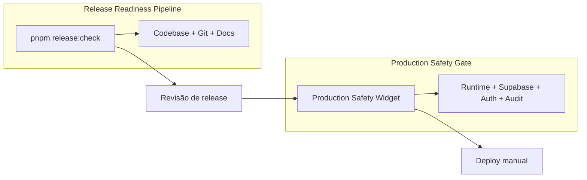

# Release Readiness Pipeline — Douglas AI Platform

> Status: Foundation v1.0  
> Sprint: 5.37  
> Escopo: diagnóstico **estático** da codebase e do repositório antes de revisão de release.

## Objetivo

Determinar se uma versão da Douglas AI OS está **tecnicamente pronta para revisão de release** — sem publicar nada automaticamente.

O pipeline agrega validação do monorepo (`pnpm validate`) com checks de estrutura Supabase, segurança de arquivos locais, documentação operacional e scan seguro de secrets versionados.

## Comando

```bash
pnpm release:check
```

Saída compacta com:

- checks aprovados
- alertas (warnings)
- checks bloqueantes
- status final (`passed` | `passed_with_warnings` | `failed`)
- próximos passos sugeridos

Exit code `1` apenas quando status = `failed`.

## O que é verificado

| Check | Bloqueante | Descrição |
|-------|------------|-----------|
| `validate_pipeline` | Sim | Executa `pnpm validate` (typecheck → lint → build) |
| `supabase_migrations_present` | Sim | Catálogo mínimo de migrations em `supabase/migrations/` |
| `audit_ingest_function_present` | Sim* | Edge Function `audit-ingest` + README |
| `env_example_present` | Sim | `.env.example` na raiz com chaves Supabase documentadas |
| `env_local_not_tracked` | Sim | `.env.local` não versionado |
| `supabase_temp_not_tracked` | Sim | `supabase/.temp/` não versionado |
| `audit_write_mode_edge_function` | Sim | `writeMode: "edge_function"` no HQ |
| `operational_docs_present` | Sim | Documentação operacional/arquitetura obrigatória |
| `versioned_secrets_scan` | Sim | Padrões óbvios de secrets em arquivos rastreados pelo Git |
| `rbac_verification_tests` | Sim | Executa `pnpm test:rbac` (Vitest, Sprint 5.38) |

\* Alertas não bloqueantes quando handler ou README não são identificados claramente.

## O que **não** faz

| Ação | Status |
|------|--------|
| Deploy de Edge Function | ❌ Nunca |
| Apply de migrations | ❌ Nunca |
| Conexão ao banco remoto | ❌ Nunca |
| Modificar arquivos | ❌ Nunca |
| Exigir secrets reais | ❌ Nunca |
| Imprimir valores sensíveis | ❌ Nunca |

## Release Readiness vs Production Safety Gate

Dois diagnósticos complementares — **um não substitui o outro**.



| Aspecto | Release Readiness | Production Safety Gate |
|---------|-------------------|------------------------|
| Momento | Antes de PR / tag / revisão | No ambiente alvo (staging/prod) |
| Tipo | Estático (repo + build) | Runtime (conexão, auth, ingest) |
| Requer Supabase configurado | Não | Sim |
| Requer usuário autenticado | Não | Sim (para checks completos) |
| Bloqueia CI | Sim (checks bloqueantes) | Não (widget operacional) |
| Sprint | 5.37 | 5.34 |

**Fluxo recomendado:**

1. Desenvolvedor roda `pnpm release:check` localmente antes do PR.
2. CI executa `validate.yml` e `release-readiness.yml` em PRs e push para `main`.
3. Após merge, operador aplica migrations e deploy **manualmente**.
4. No ambiente, operador usa o **Production Safety Gate** para confirmar runtime.

## Local vs CI

| | Local | CI (GitHub Actions) |
|---|-------|---------------------|
| Comando | `pnpm release:check` | `pnpm release:check` |
| `pnpm validate` | Incluído | Incluído |
| Git disponível | Sim (checks de tracking) | Sim |
| Secrets Supabase | Não necessários | Não necessários |
| Tempo típico | 2–5 min (depende do build) | Similar |

Em CI, o workflow `release-readiness.yml` usa Node **22** e pnpm **9.15.9** (alinhado ao `packageManager` do root).

## Estrutura de arquivos

| Arquivo | Função |
|---------|--------|
| `scripts/release-readiness.ts` | Entry point CLI |
| `scripts/release-readiness/ReleaseReadinessStatus.ts` | Tipos de status |
| `scripts/release-readiness/ReleaseReadinessCheck.ts` | IDs, labels e catálogos |
| `scripts/release-readiness/ReleaseReadinessReport.ts` | Agregação e particionamento |
| `scripts/release-readiness/ReleaseReadinessRunner.ts` | Execução read-only dos checks |
| `.github/workflows/validate.yml` | CI — `pnpm validate` |
| `.github/workflows/release-readiness.yml` | CI — `pnpm release:check` |

## Interpretando warnings

Warnings **não falham** o pipeline (`passed_with_warnings`), mas indicam dívida ou risco operacional:

- `.env.example` sem chave esperada
- `git ls-files` indisponível (ambiente sem Git)
- Edge Function sem handler claramente identificado
- Path sensível não listado no `.gitignore` (mas não rastreado)

Revise warnings antes de solicitar deploy em produção.

## Por que deploy continua manual

Nesta fase, release readiness confirma **qualidade e conformidade do repositório**. Deploy de Edge Functions, apply de migrations e promoção entre ambientes exigem:

- credenciais reais (fora do CI)
- janela operacional acordada
- validação runtime (Production Safety Gate)
- revisão humana explícita

Automatizar deploy será tratado em sprint futura de CD — não nesta esteira.

## Referências

- `docs/engineering/validation-pipeline.md` — typecheck, lint, build
- `docs/operations/release-checklist.md` — checklist operacional humano
- `docs/operations/production-safety-gate.md` — gate runtime
- `docs/architecture/audit-edge-function.md` — Edge Function audit-ingest
